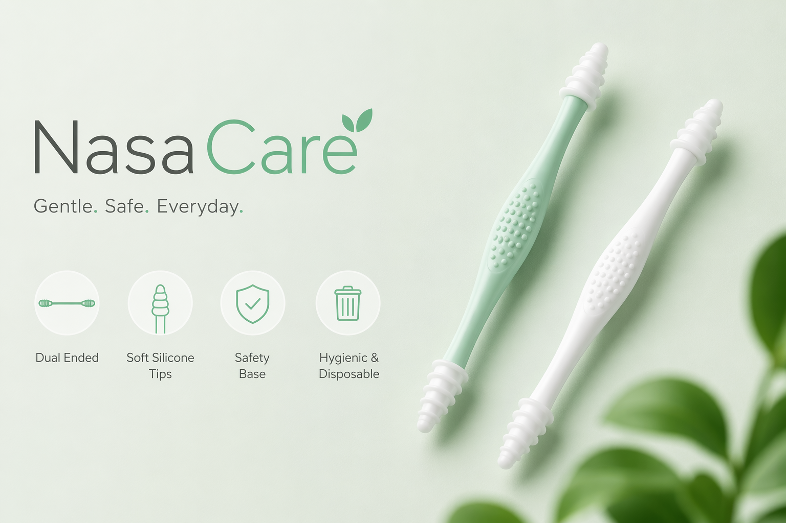
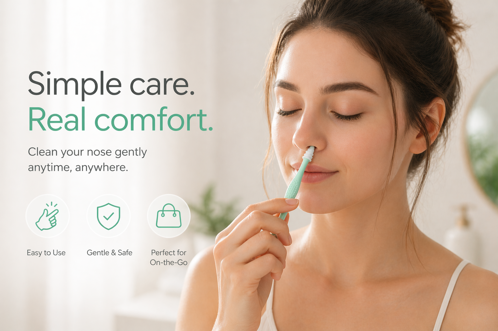
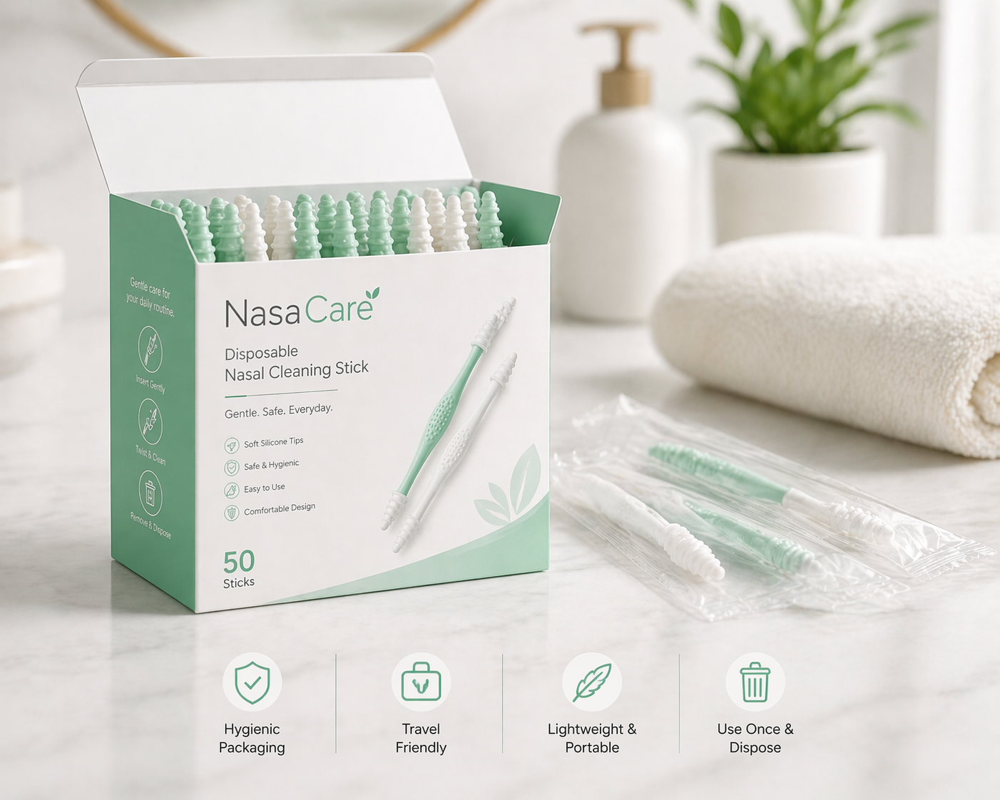
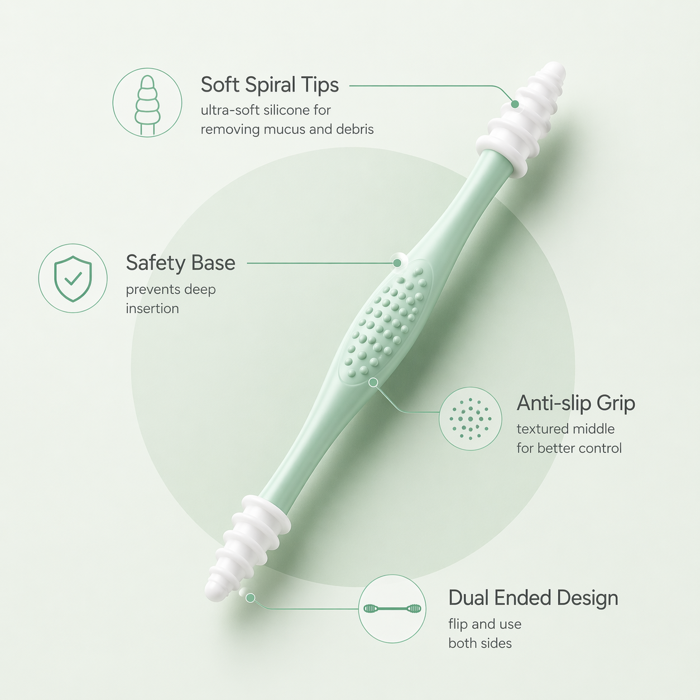

# NasaCare

Gentle, safe, and modern nasal hygiene for everyday life.

## Live Website

Visit the official website here: [https://nasacare.vercel.app/](https://nasacare.vercel.app/)

## What Is NasaCare?

NasaCare is a disposable nasal cleaning stick designed to make personal hygiene simple, hygienic, and comfortable.

It is built for people who want:

- A gentle cleaning experience
- A safer product design
- Portable, travel-friendly use
- A clean and discreet daily care routine

## Product Highlights

- Dual ended design
- Soft silicone tips
- Safety base for controlled use
- Anti-slip grip
- Disposable and hygienic

## Website Preview

### Hero Product

### Lifestyle Usage

### Packaging

### Features Diagram

## Website Pages

- Home
- Product
- How It Works
- About
- FAQ
- Pricing
- Contact

## Brand Feel

The website is designed to feel:

- Clean
- Trustworthy
- Professional
- Soft and premium
- Startup-ready

## For Customers

NasaCare is made for everyday users who want a quick, hygienic alternative to tissues and traditional tools.

If you are visiting for product details, start here:

- Website: [https://nasacare.vercel.app/](https://nasacare.vercel.app/)
- Pricing Page: [https://nasacare.vercel.app/pricing](https://nasacare.vercel.app/pricing)
- FAQ Page: [https://nasacare.vercel.app/faq](https://nasacare.vercel.app/faq)

## Contact

For product and support inquiries, please use the contact page:

[https://nasacare.vercel.app/contact](https://nasacare.vercel.app/contact)
